# Python Architecture: Object Diagram

Components on the Python side only (up to the named pipe; DLL excluded).

Items marked **[hardcoded]** are not modular or configurable.

---

## Object Diagram

```mermaid
classDiagram
    direction TB

    %% ─── AGENT SIDE ─────────────────────────────────────────────

    class AgentLoop {
        <<experiments/run.py>>
        model : ModelAdapter
        journal : TurnJournal
        base_url : str
        poll_interval : float
        run_game_loop()
        run_turn()
        execute_tool()
    }
    note for AgentLoop "poll_interval default=2.0s [hardcoded]\ntemperature=0.2 [hardcoded]\nreflection gate on first end_turn [hardcoded]\nturn detection by polling /status [hardcoded — should be SSE push]"

    class ModelAdapter {
        <<agent_runtime/models/base.py>>
        name() str
        generate(messages, tools) GenerateResponse
        generate_text(messages) str
    }

    class OpenAIChat {
        <<models/openai_adapter.py>>
        model : str
        api_key : str
        base_url : str
        client : openai.OpenAI
    }
    note for OpenAIChat "api_key from env OPENAI_API_KEY\nbase_url from env OPENAI_BASE_URL"

    class GeminiChat {
        <<models/gemini_adapter.py>>
        model : str
        api_key : str
    }
    note for GeminiChat "api_key from env GEMINI_API_KEY\ngemini.yaml exposes key in plain text [hardcoded]"

    class DummyModel {
        <<models/dummy.py>>
        seed : int
    }

    class ModelRegistry {
        <<models/registry.py>>
        get_model(config) ModelAdapter
    }

    class GenerateResponse {
        <<models/base.py>>
        text : str
        tool_calls : List[ToolCall]
        raw_response : Any
        usage : Dict
    }

    class ToolCall {
        <<models/base.py>>
        id : str
        name : str
        arguments : Dict
    }

    class ToolSchemas {
        <<agent_runtime/tools/schemas.py>>
        TOOL_SCHEMAS : List[dict]
        get_openai_tools() List
        get_gemini_tools() List
        get_tool_names() List[str]
    }
    note for ToolSchemas "45+ tool defs [hardcoded]\nNOT auto-generated from orchestrator _TOOLS\nmust be kept in sync manually with CivMCPServer"

    class SystemPrompt {
        <<agent_runtime/prompts/system_prompt.py>>
        build_system_prompt(personality, interactive) str
        generate_reflection_prompt(turn) str
    }
    note for SystemPrompt "prompt text [hardcoded]\ngenerate_reflection_prompt references\nnon-existent update_knowledge_base [broken]"

    class TurnBriefing {
        <<agent_runtime/briefing.py>>
        generate_turn_briefing(...) str
    }

    class Personality {
        <<agent_runtime/prompts/personality.py>>
        aggression : str
        expansion : str
        diplomacy : str
        planning : str
        risk : str
        voice : str
        values : List[str]
        fears : List[str]
        joys : List[str]
    }
    note for Personality "6 presets: Scholar, Emperor, Survivor,\nAdventurer, Builder, Warlord [hardcoded]\nnot selectable from config YAML"

    class TurnJournal {
        <<agent_runtime/memory/journal.py>>
        storage_path : Path
        _players : Dict[str, PlayerProfile]
        _narratives : Dict[int, GameNarrative]
        _current_player_id : str
        set_current_player(model_name)
        record_turn(game_id, turn, text)
        record_lesson(content, game_id, turn, category)
        get_lessons(category, limit) List[Lesson]
        build_context_summary(game_id, turn) str
        update_narrative(game_id, ...) None
    }
    note for TurnJournal "storage path=game_journal.json [hardcoded]\nplayer_id scoping from model name\n(normalization implicit, undocumented)"

    class PlayerProfile {
        <<journal.py>>
        player_id : str
        lessons : List[Lesson]
        games_played : int
        total_turns : int
    }

    class GameNarrative {
        <<journal.py>>
        game_id : int
        player_id : str
        leader_name : str
        story_so_far : str
        current_strategy : str
        relationships : Dict[str, str]
        memories : List[TurnRecap]
    }

    %% ─── ORCHESTRATOR SIDE ──────────────────────────────────────

    class MCPHTTPServer {
        <<orchestrator/mcp_http_server.py>>
        host : str
        port : int
        mcp_server : CivMCPServer
        GET /health
        GET /status
        GET /tools
        POST /tool
    }
    note for MCPHTTPServer "host default=localhost [hardcoded]\nport default=8765 [hardcoded]\nno auth on HTTP endpoints [hardcoded]"

    class CivMCPServer {
        <<orchestrator/mcp_server.py>>
        _send_request : Callable
        game_state : GameState
        _message_logger : MessageLogger
        _TOOLS : Dict
        execute_tool(name, args) Any
    }
    note for CivMCPServer "60+ tools [hardcoded]\n_TOOLS dict and ToolSchemas MUST be\nkept in sync manually — no enforcement"

    class GameState {
        <<orchestrator/game_state.py>>
        _turn_number : int
        _game_id : int
        _session_id : int
        _player_id : int
        _player_name : str
        _connected : bool
        update_from_message(msg)
    }

    class NamedPipeServer {
        <<orchestrator/pipe_server.py>>
        pipe_name : str
        game_state : GameState
        _pipe_conn : PipeConnection
        _message_queue : Queue
        _worker_thread : Thread
        send_request(req, timeout) Any
    }
    note for NamedPipeServer "pipe_name=\\.\\pipe\\civv_llm [hardcoded default]\nWindows named pipe only — not portable"

    class PipeConnection {
        <<orchestrator/pipe_server.py>>
        _handle : int
        _pending : Dict[str, Queue]
        send_request(req) response
    }

    class MessageLogger {
        <<orchestrator/message_logger.py>>
        log_dir : Path
        _game_state : GameState
        log(type, data, direction)
    }
    note for MessageLogger "log_dir=python/logs/ [hardcoded default]\nper-game JSONL files"

    %% ─── RELATIONSHIPS ───────────────────────────────────────────

    AgentLoop --> ModelAdapter        : uses
    AgentLoop --> TurnJournal         : reads / writes
    AgentLoop --> SystemPrompt        : calls
    AgentLoop --> TurnBriefing        : calls
    AgentLoop --> ToolSchemas         : gets tool list
    AgentLoop ..> MCPHTTPServer       : HTTP GET /status (polls)
    AgentLoop ..> MCPHTTPServer       : HTTP POST /tool

    ModelRegistry --> ModelAdapter    : creates

    ModelAdapter <|-- OpenAIChat
    ModelAdapter <|-- GeminiChat
    ModelAdapter <|-- DummyModel
    ModelAdapter --> GenerateResponse : returns
    GenerateResponse *-- ToolCall

    TurnBriefing --> TurnJournal      : reads context
    TurnBriefing --> Personality      : uses voice/values
    SystemPrompt --> Personality      : uses voice/values
    TurnJournal *-- PlayerProfile
    TurnJournal *-- GameNarrative

    MCPHTTPServer --> CivMCPServer    : delegates tool calls
    MCPHTTPServer --> GameState       : reads for /status
    CivMCPServer --> GameState        : reads metadata
    CivMCPServer --> NamedPipeServer  : calls send_request()
    CivMCPServer --> MessageLogger    : logs tool calls

    NamedPipeServer --> GameState     : updates on DLL messages
    NamedPipeServer *-- PipeConnection
    NamedPipeServer --> MessageLogger : logs pipe messages
```

---

## Hardcoded / Non-modular Summary

| Item | Location | Notes |
|---|---|---|
| `poll_interval = 2.0s` | `run.py` | Agent polls `/status`; should be SSE push per CLAUDE.md |
| `temperature = 0.2` | `run.py:run_turn()` | Not in config YAML |
| Reflection gate logic | `run.py` | Intercepts first `end_turn`; wired into loop body |
| Tool schemas (45+) | `tools/schemas.py` | Manually maintained; not derived from orchestrator |
| `_TOOLS` (60+) | `mcp_server.py` | The other half of the same manual sync problem |
| System prompt text | `system_prompt.py` | Not templated or config-driven |
| `generate_reflection_prompt` | `system_prompt.py` | References `update_knowledge_base` which does not exist |
| 6 personality presets | `personality.py` | No personality field in config YAML |
| `game_journal.json` path | `journal.py` | Not configurable |
| Player ID scoping | `journal.py:set_current_player()` | Implicit normalization, undocumented |
| `python/logs/` log dir | `message_logger.py` | Not configurable |
| Port `8765` | `mcp_http_server.py` / `__main__.py` | CLI flag exists but default is baked in |
| `\\.\pipe\civv_llm` | `pipe_server.py` / `__main__.py` | CLI flag exists but Windows-only, no abstraction |
| No HTTP auth | `mcp_http_server.py` | Any local process can call `/tool` |

## What Is Modular / Configurable

| Item | Mechanism |
|---|---|
| LLM backend | `config.yaml → backend.kind` → `ModelRegistry` |
| Model name, API key, base URL | `config.yaml` or environment variables |
| Orchestrator URL | `config.yaml → orchestrator.url` |
| Pipe path | `config.yaml → orchestrator.pipe` (also CLI flag) |
| HTTP port | CLI flag `--port` |
| Interactive mode | `config.yaml → orchestrator.interactive` or `--interactive` flag |
