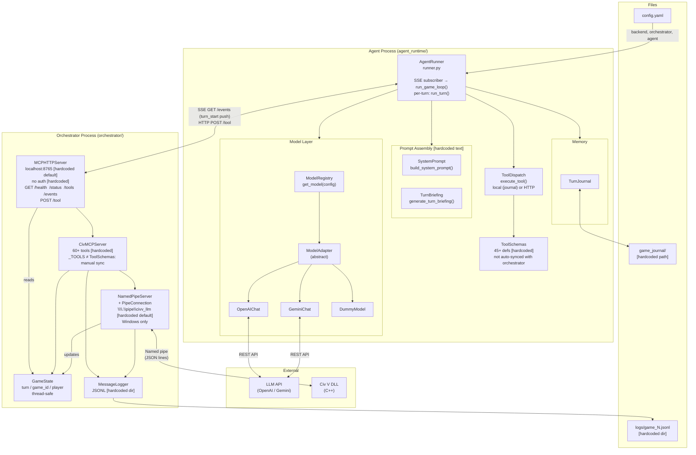

# Python Architecture

Components on the Python side only (up to the named pipe; DLL excluded).

Items marked **[hardcoded]** are not modular or configurable.

---

## Block Diagram

---

## Object Diagram

```mermaid
classDiagram
    direction TB

    %% ─── AGENT SIDE ─────────────────────────────────────────────

    class AgentRunner {
        <<agent_runtime/runner.py>>
        model : ModelAdapter
        journal : TurnJournal
        base_url : str
        run_game_loop()
        main()
    }
    note for AgentRunner "SSE subscriber on GET /events\nreconnects on stream loss\nper-turn: delegates to run_turn()"

    class TurnRunner {
        <<agent_runtime/turn_runner.py>>
        run_turn(model, ctx, timeout, interactive, temperature) dict
        build_assistant_message(response) dict
        build_tool_result_message(tool_call, result) dict
        prompt_operator(turn, iteration) str
    }
    note for TurnRunner "reflection gate: intercepts first end_turn\nsilent streak detection (3 consecutive no-tool responses)\ntimeout guard"

    class TurnContext {
        <<agent_runtime/context.py>>
        base_url : str
        turn : int
        game_id : int
        player_name : str
    }

    class ModelAdapter {
        <<agent_runtime/models/base.py>>
        name() str
        generate(messages, tools, temperature) GenerateResponse
    }

    class OpenAIChat {
        <<models/openai_adapter.py>>
        model : str
        api_key : str
        base_url : str
    }
    note for OpenAIChat "api_key from OPENAI_API_KEY\nbase_url from config or OPENAI_BASE_URL"

    class GeminiChat {
        <<models/gemini_adapter.py>>
        model : str
        api_key : str
    }
    note for GeminiChat "api_key from GEMINI_API_KEY"

    class DummyModel {
        <<models/dummy.py>>
    }

    class ModelRegistry {
        <<models/registry.py>>
        get_model(config) ModelAdapter
    }

    class GenerateResponse {
        <<models/base.py>>
        text : str
        tool_calls : List[ToolCall]
        raw_response : Any
        usage : Dict
    }

    class ToolCall {
        <<models/base.py>>
        id : str
        name : str
        arguments : Dict
    }

    class ToolDispatch {
        <<agent_runtime/tools/dispatch.py>>
        LOCAL_HANDLERS : Dict
        execute_tool(tool_call, ctx) dict
    }
    note for ToolDispatch "journal tools handled locally\nall others routed to orchestrator via HTTP POST /tool"

    class ToolSchemas {
        <<agent_runtime/tools/schemas.py>>
        TOOL_SCHEMAS : List[dict]
        get_openai_tools() List
        get_gemini_tools() List
        get_tool_names() List[str]
    }
    note for ToolSchemas "45+ tool defs [hardcoded]\nNOT auto-generated from orchestrator _TOOLS\nmust be kept in sync manually with CivMCPServer"

    class SystemPrompt {
        <<agent_runtime/prompts/system_prompt.py>>
        build_system_prompt(interactive) str
    }

    class TurnBriefing {
        <<agent_runtime/briefing.py>>
        generate_turn_briefing(turn, game_id, player_name, state) str
        generate_reflection_prompt(turn) str
    }
    note for TurnBriefing "fetches cities/units/techs at turn start\ninjects journal context (identity, strategy, recaps, lessons)"

    class TurnJournal {
        <<agent_runtime/memory/journal.py>>
        storage_dir : Path
        _players : Dict[str, PlayerProfile]
        _narratives : Dict[int, GameNarrative]
        _current_player_id : str
        set_current_player(model_name) str
        record_turn(game_id, turn, text)
        record_lesson(content, game_id, turn, category)
        get_lessons(category, limit) List[Lesson]
        get_recaps(game_id, limit) List[TurnRecap]
        update_narrative(game_id, ...) None
        build_context_summary(game_id, turn) str
    }
    note for TurnJournal "storage at game_journal/ [hardcoded]\nplayer_id = normalize_player_id(model_name)\neach model has isolated lessons"

    class PlayerProfile {
        <<journal.py>>
        player_id : str
        lessons : List[Lesson]
    }

    class GameNarrative {
        <<journal.py>>
        game_id : int
        player_id : str
        leader_name : str
        civ_name : str
        current_strategy : str
        memories : List[TurnRecap]
    }

    class Lesson {
        <<journal.py>>
        content : str
        source_game_id : int
        turn_learned : int
        category : str
    }

    class TurnRecap {
        <<journal.py>>
        turn : int
        text : str
    }

    %% ─── ORCHESTRATOR SIDE ──────────────────────────────────────

    class MCPHTTPServer {
        <<orchestrator/mcp_http_server.py>>
        host : str
        port : int
        mcp_server : CivMCPServer
        GET /health
        GET /status
        GET /tools
        GET /events
        POST /tool
    }
    note for MCPHTTPServer "host default=localhost [hardcoded]\nport default=8765 [hardcoded]\nno auth on HTTP endpoints [hardcoded]\n/events is SSE stream for turn_start events"

    class CivMCPServer {
        <<orchestrator/mcp_server.py>>
        _send_request : Callable
        game_state : GameState
        _message_logger : MessageLogger
        _TOOLS : Dict
        execute_tool(name, args) Any
    }
    note for CivMCPServer "60+ tools [hardcoded]\n_TOOLS dict and ToolSchemas MUST be\nkept in sync manually — no enforcement"

    class GameState {
        <<orchestrator/game_state.py>>
        _turn_number : int
        _game_id : int
        _session_id : int
        _player_id : int
        _player_name : str
        _connected : bool
        update_from_message(msg)
    }

    class NamedPipeServer {
        <<orchestrator/pipe_server.py>>
        pipe_name : str
        game_state : GameState
        _pipe_conn : PipeConnection
        send_request(req, timeout) Any
    }
    note for NamedPipeServer "pipe_name=\\.\\pipe\\civv_llm [hardcoded default]\nWindows named pipe only — not portable"

    class PipeConnection {
        <<orchestrator/pipe_server.py>>
        _handle : int
        _pending : Dict[str, Queue]
        send_request(req) response
    }

    class MessageLogger {
        <<orchestrator/message_logger.py>>
        log_dir : Path
        _game_state : GameState
        log(type, data, direction)
    }
    note for MessageLogger "log_dir=python/logs/ [hardcoded default]\nper-game JSONL files"

    %% ─── RELATIONSHIPS ───────────────────────────────────────────

    AgentRunner --> TurnRunner            : calls run_turn()
    AgentRunner --> TurnJournal           : set_current_player()
    AgentRunner ..> MCPHTTPServer         : SSE GET /events

    TurnRunner --> ModelAdapter           : generate()
    TurnRunner --> SystemPrompt           : build_system_prompt()
    TurnRunner --> TurnBriefing           : generate_turn_briefing()
    TurnRunner --> ToolDispatch           : execute_tool()
    TurnRunner --> ToolSchemas            : get_openai_tools()
    TurnRunner --> TurnContext            : reads

    TurnBriefing --> TurnJournal          : build_context_summary()
    TurnBriefing ..> MCPHTTPServer        : fetch_turn_state() via HTTP

    ToolDispatch ..> TurnJournal          : journal tools (local)
    ToolDispatch ..> MCPHTTPServer        : game tools via HTTP POST /tool

    ModelRegistry --> ModelAdapter        : creates
    ModelAdapter <|-- OpenAIChat
    ModelAdapter <|-- GeminiChat
    ModelAdapter <|-- DummyModel
    ModelAdapter --> GenerateResponse     : returns
    GenerateResponse *-- ToolCall

    TurnJournal *-- PlayerProfile
    TurnJournal *-- GameNarrative
    PlayerProfile *-- Lesson
    GameNarrative *-- TurnRecap

    MCPHTTPServer --> CivMCPServer        : delegates tool calls
    MCPHTTPServer --> GameState           : reads for /status and /events
    CivMCPServer --> GameState            : reads metadata
    CivMCPServer --> NamedPipeServer      : calls send_request()
    CivMCPServer --> MessageLogger        : logs tool calls

    NamedPipeServer --> GameState         : updates on DLL messages
    NamedPipeServer *-- PipeConnection
    NamedPipeServer --> MessageLogger     : logs pipe messages
```

---

## Hardcoded / Non-modular Summary

| Item | Location | Notes |
|---|---|---|
| Reflection gate logic | `turn_runner.py` | Intercepts first `end_turn`; wired into loop body |
| Tool schemas (45+) | `tools/schemas.py` | Manually maintained; not derived from orchestrator |
| `_TOOLS` (60+) | `mcp_server.py` | The other half of the same manual sync problem |
| System prompt text | `system_prompt.py` | Not templated or config-driven |
| `game_journal/` path | `journal.py` | Not configurable |
| `python/logs/` log dir | `message_logger.py` | Not configurable |
| Port `8765` | `mcp_http_server.py` | CLI flag exists but default is baked in |
| `\\.\pipe\civv_llm` | `pipe_server.py` | CLI flag exists but Windows-only, no abstraction |
| No HTTP auth | `mcp_http_server.py` | Any local process can call `/tool` |

## What Is Modular / Configurable

| Item | Mechanism |
|---|---|
| LLM backend | `config.yaml → backend.kind` → `ModelRegistry` |
| Model name, API key, base URL | `config.yaml` or environment variables |
| Orchestrator URL | `config.yaml → orchestrator.url` |
| Temperature | `config.yaml → agent.temperature` |
| Turn timeout | `config.yaml → orchestrator.turn_timeout` |
| Interactive mode | `config.yaml → orchestrator.interactive` or `--interactive` flag |
| HTTP port | CLI flag `--mcp-port` |
| Pipe path | CLI flag `--pipe` or `CIVV_PIPE` env var |
